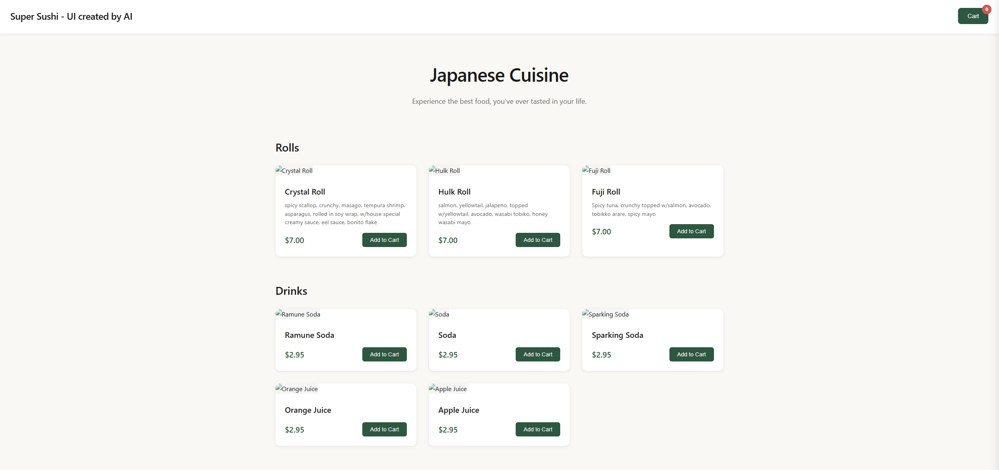

## 🍣 Super Sushi: A Spring Boot REST API Project 🚀

This project, **Super Sushi**, is a **Spring Boot** application written in **Java** that demonstrates the development of a **REST API**. Beyond the core application functionality, it serves as a practical example of **version control best practices**, showcasing a clear history of committed features, bug fixes, and subsequent refactoring.

-----

### Key Features and Purpose

* **RESTful API Implementation:** Super Sushi establishes a functional REST API, with its specific endpoints and structure detailed within the project's subfolders.
* **Version Control Demonstration:** The project's commit history is an intentional artifact, illustrating the cyclical process of **committing features, encountering/fixing bugs, and re-fixing/refactoring** the codebase for improved stability and clarity.
* **Web Application Foundation:** The choice of a web application provides a tangible platform for interacting with the developed API.

-----

### 🎨 User Interface Development Disclaimer

The User Interface (UI) for this project was developed with assistance from an **AI tool** ([v0.dev](https://www.v0.dev/)).

> **Note:** Leveraging AI for UI development provided valuable insights into **design principles** and the **interaction patterns** between different UI elements, challenging initial assumptions and offering a structured approach to front-end development.

-----

### 📊 Project Architecture

## UML

*(Insert your professional UML diagram image/link here.)*

-----

### 💻 Code Highlight: Dynamic Configuration

The following code snippet demonstrates a mechanism for **dynamically adjusting frontend variables** by editing the base HTML file. This technique ensures the application's client-side presentation remains correctly configured with the server-side state.

```java
// For example:
// File: src/main/java/com/SushiAPI/SushiAPI/controller/Receipt/ReceiptController.java
@GetMapping("/receipt")
    public String showReceipt(Model model, @RequestBody String receiptData) {
        JSONObject jsonObject = new JSONObject(receiptData);

        StringBuilder htmlBuilder = new StringBuilder();
        JSONArray jsonArray = jsonObject.getJSONArray("items");

        for (int i = 0; i < jsonArray.length(); i++) {
            JSONObject item = jsonArray.getJSONObject(i);
            htmlBuilder.append("<div class=\"receipt-row\">")
                    .append("<span class=\"item-name\">").append(item.getString("itemName")).append("</span>")
                    .append("<span class=\"item-price\">$").append(item.getDouble("itemPrice")).append("</span>")
                    .append("</div>");
        }

        model.addAttribute("subTotal", jsonObject.getDouble("subTotal"));
        model.addAttribute("tax", jsonObject.getDouble("tax"));
        model.addAttribute("total", jsonObject.getDouble("total"));
        model.addAttribute("amountPaid", jsonObject.getDouble("amountPaid"));
        model.addAttribute("items", htmlBuilder.toString());
        return "receipt";
    }

```

-----
## 🌐 FrontEnd Images: Home page

